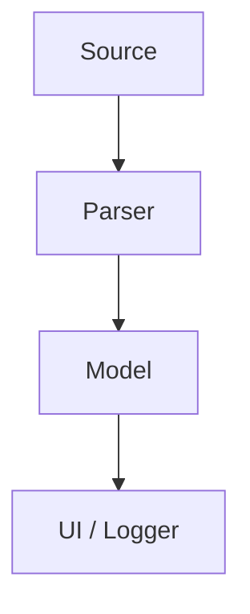

# Task Flow

## 1. Data Flow Diagram

## 2. Description
- **Source**: Serial port or Simulator providing binary data.
- **Parser**: Converts raw binary protocol to `DataFrame`.
- **Model**: Manages the collection of `DataFrame` objects.
- **UI / Logger**: Visualizes data in real-time and logs to binary file.
